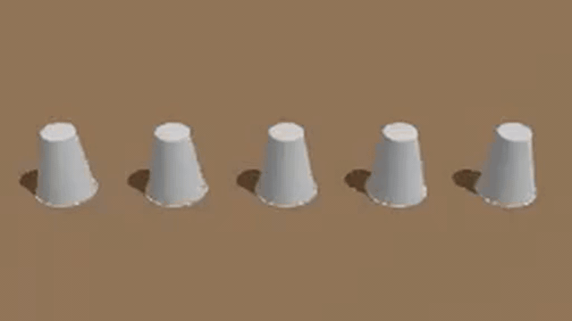

<div align="center">

# Can Video World Models Track Unobserved World States?

[Joonghyuk Shin](https://joonghyuk.com/)<sup>1</sup> · [Yicong Hong](https://yiconghong.github.io/)<sup>2</sup> · [Jaesik Park](https://jaesik.info/)<sup>1</sup> · [Xun Huang](https://www.xunhuang.me/)<sup>2</sup>

<sup>1</sup>Seoul National University · <sup>2</sup>Roblox

[](https://arxiv.org/abs/2608.30692)
[](https://joonghyuk.com/stateful-vwm-web/)



</div>

---

## Coming Soon

Code and models will be released soon. We are currently cleaning up the codebase :)

## Citation

```bibtex
@article{shin2026statefulvwm,
  title   = {{Can Video World Models Track Unobserved World States?}},
  author  = {Shin, Joonghyuk and Hong, Yicong and Park, Jaesik and Huang, Xun},
  journal = {arXiv preprint arXiv:2608.30692},
  year    = {2026}
}
```
